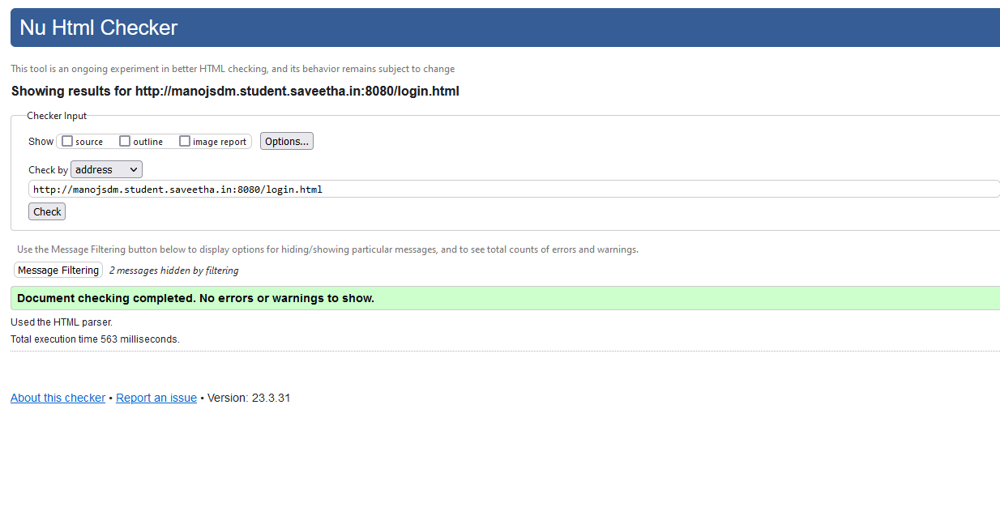

# Design a Website for Server Side Processing

## AIM:
To design a website to perform mathematical calculations in server side.

## DESIGN STEPS:

### Step 1:
First fork the template repository to your git hub account and clone it in theia IDE. Now start working in the local repository.


### Step 2:
Create a new project folder and a app too. Create a template for your website using HTML and CSS. Create appropiate view method for your template.


### Step 3:
Use internal CSS it is easy work with when we use only one template. Use POST method instead of GET inorder to gain efficiency.


### Step 4:
Publish the website in the given URL.


## PROGRAM :
```
<html>
<head>
   <meta charset='utf-8'>
   <meta http-equiv='X-UA-Compatible' content='IE=edge'>
   <title>Area of Rectangle</title>
<meta name='viewport' content='width=device-width, initial-scale=1'>
<style type="text/css">
body 
{
background-color:rgb(84, 173, 173);
}
.edge {
width: 1080px;
margin-left: auto;
margin-right: auto;
padding-top: 200px;
padding-left: 300px;
}
.box {
display:block;
border: inset;
width: 500px;
min-height: 300px;
font-size: 20px;
background-color: rgb(23, 68, 136);
}
.formelt{
color: rgb(16, 218, 151);
text-align: center;
margin-top: 5px;
margin-bottom: 5px;
}
h1
{
color: rgb(174, 0, 255);
text-align: center;
padding-top: 20px;
}
</style>
</head>
<body>
<div class="edge">
<div class="box">
<h1>Area of a Rectangle</h1>
<form method="POST">

<div class="formelt">
Length : <input type="text" name="length" value="{{l}}"></input>(in m)<br/>
</div>
<div class="formelt">
Breadth : <input type="text" name="breadth" value="{{b}}"></input>(in m)<br/>
</div>
<div class="formelt">
<input type="submit" value="Calculate"></input><br/>
</div>
<div class="formelt">
Area : <input type="text" name="area" value="{{area}}"></input>m<sup>2</sup><br/>
</div>
</form>
</div>
</div>
</body>
</html>

```


## OUTPUT:

### Home Page:

### Server :

### HTML Validator


## Result:
The program for implementing server side processing is completed successfully.
